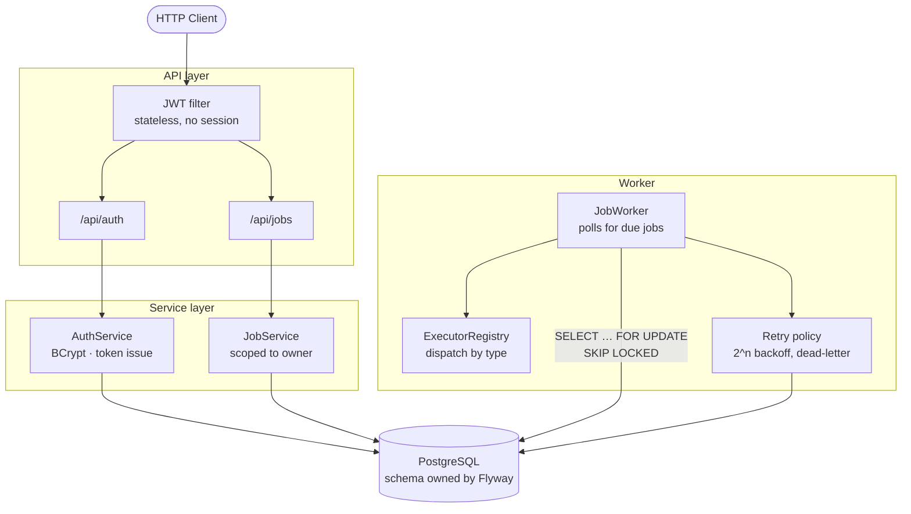
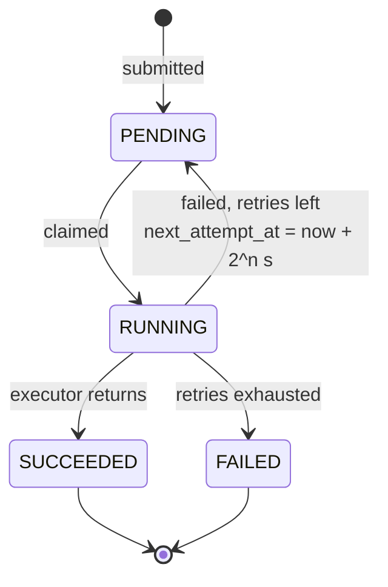

# Nimbus

A distributed job execution platform. You submit jobs over an HTTP API, workers pick them up and run them, and the platform handles retries, backoff, and failures along the way. Think of it as a stripped-down Sidekiq or AWS Batch, built to understand how those systems actually work underneath.

[](https://github.com/GauravAcharya511/nimbus-job-platform/actions/workflows/ci.yml)

Java 21 · Spring Boot 4 · PostgreSQL · Flyway · Docker · Testcontainers

---

## Why this exists

I wanted a project where the interesting problems were real ones — concurrent workers competing for the same queue, what happens when a job fails halfway through, how you stop one user from reading another's data. Most tutorial backends stop at CRUD. This one starts there and keeps going.

Everything here runs. `docker compose up` gets you a working system in one command, and the benchmark script at the bottom is the same one I used to produce the numbers in this README.

## Quick start

```bash
git clone https://github.com/GauravAcharya511/nimbus-job-platform.git
cd nimbus-job-platform
docker compose up -d --build
```

That starts PostgreSQL, waits for it to pass a health check, runs the Flyway migrations, and brings up the app on port 8081. Give it about a minute on first run — Maven downloads the world inside the build container.

```bash
curl http://localhost:8081/actuator/health
# {"status":"UP","groups":["liveness","readiness"]}
```

Running it directly instead of through Docker:

```bash
docker compose up -d postgres     # just the database
./mvnw spring-boot:run
```

The port is configurable via `NIMBUS_PORT` if 8081 is taken.

## Using it

Register to get a token. Everything except `/api/auth/**` and the health endpoint needs one.

```bash
curl -X POST http://localhost:8081/api/auth/register \
  -H 'Content-Type: application/json' \
  -d '{"email":"you@example.com","password":"password123","firstName":"Your","lastName":"Name"}'
```

```json
{
  "token": "eyJhbGciOiJIUzI1NiJ9...",
  "tokenType": "Bearer",
  "expiresInMinutes": 60
}
```

Submit a job:

```bash
curl -X POST http://localhost:8081/api/jobs \
  -H "Authorization: Bearer $TOKEN" \
  -H 'Content-Type: application/json' \
  -d '{"type":"echo","payload":"hello nimbus"}'
```

```
HTTP/1.1 201 Created
Location: /api/jobs/259e1680-d5ae-49f9-a995-dad576586fb6
```

Wait a moment and read it back — the worker will have picked it up:

```json
{
  "id": "259e1680-d5ae-49f9-a995-dad576586fb6",
  "type": "echo",
  "status": "SUCCEEDED",
  "attempts": 0,
  "maxAttempts": 3,
  "createdAt": "2026-07-22T08:36:06.930Z",
  "startedAt": "2026-07-22T08:36:06.973Z",
  "completedAt": "2026-07-22T08:36:06.991Z"
}
```

### Endpoints

| Method | Path | What it does |
|---|---|---|
| `POST` | `/api/auth/register` | Create an account, get a token back |
| `POST` | `/api/auth/login` | Exchange credentials for a token |
| `POST` | `/api/jobs` | Submit a job — returns `201` and a `Location` header |
| `GET` | `/api/jobs?page=0&size=20` | List your jobs, paginated |
| `GET` | `/api/jobs/{id}` | Fetch one job |
| `GET` | `/actuator/health` | Health check |

Errors come back as [RFC 7807](https://datatracker.ietf.org/doc/html/rfc7807) problem details, so a validation failure looks like this rather than a stack trace:

```json
{ "status": 400, "detail": "type: type is required" }
```

### Scheduling

Run something later:

```bash
-d '{"type":"echo","payload":"later","scheduledAt":"2026-08-01T09:00:00Z"}'
```

Or on a schedule — standard Spring cron, six fields including seconds:

```bash
-d '{"type":"echo","payload":"nightly","cronExpression":"0 0 3 * * *"}'
```

Recurring jobs work by enqueueing the next occurrence when a run succeeds, rather than
mutating a single row. Every run keeps its own status, timing, and error, and each links
back to the original through `parentJobId` — so the full execution history of a schedule
stays queryable. A failed run retries on its own backoff and does not spawn a successor,
which keeps a broken schedule from multiplying into an unbounded queue of failures.

Invalid cron expressions are rejected at submission with a `400` rather than failing
silently at execution time.

### Cancellation

```bash
curl -X DELETE http://localhost:8081/api/jobs/{id} -H "Authorization: Bearer $TOKEN"
```

Cancelling any occurrence of a recurring job stops the whole schedule — the worker
checks the series before enqueueing a successor. A `RUNNING` job is rejected with `409`:
it is already executing, and interrupting it would leave its side effects half-applied.
Doing that properly needs cooperative cancellation, where the executor checks a flag at
safe points, which is future work rather than something to fake.

### Lifecycle events

Every state transition is published to Kafka: `SUBMITTED`, `STARTED`, `SUCCEEDED`,
`RETRY_SCHEDULED`, `DEAD_LETTERED`, `CANCELLED`.

```bash
docker compose exec kafka /opt/kafka/bin/kafka-console-consumer.sh \
  --bootstrap-server localhost:9092 --topic nimbus.job.events --from-beginning
```

A failing job produces the full trace:

```
40a6affa  SUBMITTED        attempts=0
40a6affa  STARTED          attempts=0
40a6affa  RETRY_SCHEDULED  attempts=1
40a6affa  STARTED          attempts=1
40a6affa  RETRY_SCHEDULED  attempts=2
40a6affa  STARTED          attempts=2
40a6affa  DEAD_LETTERED    attempts=3
```

Kafka is used for **fan-out, not queuing**. PostgreSQL already handles the queue
correctly through `SKIP LOCKED`, with transactional guarantees and queryable state that
a log would not give us. What Kafka adds is letting other systems react to job state
without polling the database. Events are keyed by job id so all events for one job land
on the same partition and stay ordered, and they carry identifiers rather than payloads
so user data never reaches the topic. Publishing is best-effort: a broker outage should
degrade observability, not fail the job it is reporting on.

### Job types

Executors are discovered at startup by implementing an interface, so adding a new job type means adding one class — no registry to update, no switch statement to extend.

```java
@Component
public class SendEmailExecutor implements JobExecutor {
    @Override public String type() { return "send-email"; }
    @Override public void execute(Job job) throws Exception {
        // whatever the work is
    }
}
```

Two ship with the project: `echo` (logs its payload) and `always-fails` (throws every time, which is how I exercise the retry path).

## How it fits together



It's a modular monolith. Packages are split by domain (`auth`, `job`, `user`, `worker`) rather than by layer, which keeps the seams in the right places if any of it ever needs to become a separate service. Microservices would have been premature here and mostly would have added deployment overhead to a project with one deployable.

### What happens to a job



## Decisions worth explaining

**Workers claim jobs with `SELECT … FOR UPDATE SKIP LOCKED`.**

This is the heart of the thing. Each worker locks the rows it claims, and `SKIP LOCKED` means it steps over rows another worker is already holding instead of blocking behind them. Multiple workers partition the queue between themselves with no coordinator, no Redis lock, no leader election — just Postgres doing what it's good at. There's a test that runs four threads against thirty jobs and asserts every job executed exactly once.

Claiming and executing are deliberately separate transactions. The claim marks jobs `RUNNING` and commits straight away, so a slow job doesn't sit on a row lock for its entire duration.

**Flyway owns the schema, Hibernate only checks it.**

Running with `ddl-auto: validate` means the app refuses to start if the entities and the migrated schema have drifted apart. I'd rather find that at boot than at 2am. All schema changes go through numbered migrations in `src/main/resources/db/migration`.

**Constraints live in the database, not just the code.**

Job status is restricted by a `CHECK` constraint, and so is the `attempts <= max_attempts` invariant. If a bug ever slips past the service layer, the database still refuses to store nonsense. The integration tests assert this directly by trying to insert bad rows.

**Looking up someone else's job returns 404, not 403.**

Job queries are scoped by owner (`findByIdAndUserId`), so a job you don't own is indistinguishable from one that doesn't exist. A 403 would confirm the resource is there, which is a small information leak that costs nothing to avoid.

**Tests run against real PostgreSQL.**

Testcontainers spins up an actual database and applies the real migrations. H2 would be faster, but it wouldn't enforce the `CHECK` constraints or support `SKIP LOCKED`, which means the two most interesting tests in the suite would pass without testing anything.

### Rate limiting

Authenticated callers get a per-user token bucket: 100 requests capacity, refilling at
20/sec. Exceeding it returns `429`. Both values are configurable via
`NIMBUS_RATELIMIT_CAPACITY` and `NIMBUS_RATELIMIT_REFILL`.

The bucket update runs as a **Lua script inside Redis**, which matters more than it
might look. A read-check-write in application code races: two concurrent requests can
both observe the last token and both be allowed through. Lua scripts execute atomically
on the Redis server, so the whole sequence is indivisible. There's a test that fires 80
concurrent attempts at a bucket of 10 and asserts no more than 12 get through.

If Redis is unreachable the limiter fails open. Throttling is a protection, not a
correctness guarantee, and losing it shouldn't take the API down with it.

## Metrics

Micrometer exposes application metrics in Prometheus format at
`/actuator/prometheus`. Prometheus and Grafana ship in the compose file with a
pre-provisioned dashboard, so `docker compose up` gives you graphs at
`localhost:3000` with nothing to configure.

```
nimbus_jobs_submitted_total                              41.0
nimbus_jobs_completed_total{outcome="succeeded"}         40.0
nimbus_jobs_completed_total{outcome="failed"}             3.0
nimbus_jobs_retried_total                                 2.0
nimbus_jobs_dead_lettered_total                           1.0
nimbus_queue_depth                                        0.0
nimbus_job_execution_seconds{quantile="0.5"}          0.000143
nimbus_job_execution_seconds{quantile="0.95"}         0.000307
nimbus_job_execution_seconds{quantile="0.99"}         0.001831
```

The counters and the timer answer "how much" and "how long", but **queue depth is the
one that matters operationally**. Throughput and latency tell you what already happened;
a rising backlog tells you workers are falling behind *before* users notice anything.
It's the metric you'd alert on.

The monitoring images bake their config in rather than bind-mounting it from the host.
That keeps the stack self-contained and reproducible, and avoids depending on host
file-sharing behaviour, which is inconsistent across platforms.

## Performance

Measured against the containerized stack on Apple Silicon, single worker instance:

| | |
|---|---|
| Submission throughput | **350 req/sec** — 1,000 jobs in 2.86s |
| Execution throughput | **370 jobs/sec** — 1,000 jobs drained in 2.70s |
| Single job, end to end | **~18 ms** from submit to `SUCCEEDED` |
| Job read, uncached (Postgres) | 2.15 ms p50 |
| Job read, cached (Redis) | **1.20 ms p50** — 1.8× faster |

The interesting part is how I got there. My first run drained at 10 jobs/sec and I nearly wrote that number down. It was wrong — or rather, it was measuring the wrong thing. The worker polled once per second with a batch size of 10, so it was structurally incapable of exceeding 10 jobs/sec no matter how fast anything else ran. Dropping the poll to 200ms and the batch to 50 took it to 370 jobs/sec. Same query, same database, 37× the throughput.

Both knobs are configurable:

```bash
NIMBUS_WORKER_POLL_MS=200 NIMBUS_WORKER_BATCH_SIZE=50 ./mvnw spring-boot:run
```

Reproduce it yourself:

```bash
docker compose up -d --build
NIMBUS_RATELIMIT_ENABLED=false ./scripts/benchmark.sh 1000
```

The rate limiter has to be off for benchmarking, or the run measures the limiter rather
than the system. I found that out by having a benchmark throttle itself.

The caching result is deliberately unimpressive and worth being honest about: 1.8× is a
small win because the uncached path is already a primary-key lookup on a local database
with a warm pool, around 2 ms. Caching pays for itself when the source is slow — complex
joins, a remote database, cross-region latency — not when it's already fast. The
mechanism is sound; this particular workload just doesn't have much to save.

## Testing

```bash
./mvnw verify
```

Needs Docker running, since Testcontainers starts a real Postgres. Fifteen tests covering:

- the API surface — created, validation failures, not found, pagination
- auth — unauthenticated requests, bad credentials, duplicate registration
- multi-tenancy — two users submit jobs, each sees only their own
- the worker — success, retry with backoff, dead-lettering, unknown job types
- concurrency — four threads, thirty jobs, every job executed exactly once
- the schema itself — the database rejects invalid status values and attempt counts

CI runs the whole suite on every push and pull request.

## Notes from building it

A few things cost me more time than they should have, recorded here in case they save someone else the afternoon:

**Spring Boot 4 broke my Flyway setup silently.** Migrations just never ran. No error, no log line, clean startup. Boot 4 split auto-configuration into per-technology starters, so having `flyway-core` on the classpath is no longer enough — you need `spring-boot-starter-flyway` or the auto-config never activates. Nothing logs, because the class that would do the logging was never loaded.

**A "broken" Docker Desktop turned out to be a full disk.** The update button did nothing when clicked, repeatedly. There was 2.2 GB free and the update needed 541 MB plus room to extract. Worth checking the boring explanation first.

**A test that only passes on your machine is worse than no test.** The default context test relied on Postgres already running on localhost. Green locally, red in CI. Every test now brings its own container.

## Where it's going

- [x] **v0.1** — Job submission API, migrations, integration tests, CI
- [x] **v0.2** — JWT auth, BCrypt, per-user job ownership
- [x] **v0.3** — Worker execution, retries with exponential backoff, dead-lettering
- [x] **v0.4** — Scheduled and recurring jobs
- [x] **v0.5** — Redis-backed rate limiting and read caching
- [x] **v0.6** — Kafka job lifecycle events and job cancellation
- [x] **v0.7** — Prometheus metrics and Grafana dashboards
- [ ] **v0.8** — Horizontally scaled workers

## Stack

| | |
|---|---|
| Language | Java 21 |
| Framework | Spring Boot 4.1 |
| Database | PostgreSQL 16+ |
| Migrations | Flyway |
| Persistence | Spring Data JPA / Hibernate |
| Security | Spring Security, JJWT |
| Testing | JUnit 5, MockMvc, Testcontainers |
| Build & CI | Maven, GitHub Actions |
| Runtime | Docker, Docker Compose |

## Configuration

| Variable | Default | |
|---|---|---|
| `NIMBUS_PORT` | `8081` | HTTP port |
| `NIMBUS_JWT_SECRET` | dev value | **Set this in production.** Minimum 32 bytes |
| `NIMBUS_WORKER_POLL_MS` | `200` | How often the worker looks for jobs |
| `NIMBUS_WORKER_BATCH_SIZE` | `50` | Jobs claimed per poll |
| `SPRING_DATASOURCE_URL` | localhost | JDBC connection string |

The committed JWT secret is for local development only and the app should never be deployed with it.

## License

MIT